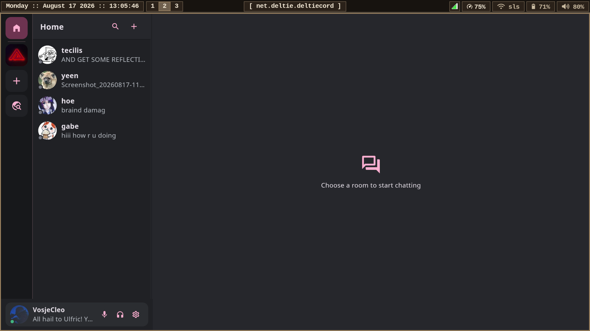

# Deltiecord

> **Latest release: version 0.9.34 build 106 — feature-scope milestone**
>
> Deltiecord now includes a live Web/PWA build at **[chat.deltie.net](https://chat.deltie.net)**.
> See [hosting and validation notes](docs/web-deployment.md) for setup and current limitations.
> Install it on an iPhone/iPad Home Screen, Android, or desktop. Build 106 adds
> Matrix threads, forums, named server roles and administration rules, browser
> SSO/OIDC, and shared profile editing/layout improvements.
> See [the changelog](CHANGELOG.md) and
> [web performance investigation](docs/web-performance-build-100-account-investigation.md).

Start with the [installation and source-build guide](INSTALL.md). Official
builds and release notes are available on the
[Deltiecord releases page](https://deltie.net/cord).

## Preface

Yes: a large part of the source code for this project was generated by a mixture of locally run LLMs.

Think of that what you want.

I am not a programmer, and I did not want becoming one to be a prerequisite for making the software I wanted. Deltiecord started because I was unhappy with the state of Discord  (particularly its lack of end-to-end encryption) and because the existing alternatives never quite offered the combination of features, usability and interface that I was looking for.

So I decided to ask my poor GPU to make me one.

The project has since gone through a rather unreasonable number of builds, rewrites, bug fixes, UI passes, regression tests and architectural cleanups. I have been directing the design, testing it in actual use, breaking it repeatedly, and making Qwen fix the resulting mess.

I want to give the result back to the community.

Please forgive my sins of vibecoding.

---

## What is Deltiecord?

Deltiecord is an open-source Flutter client for Matrix on desktop, Android, and
the web—including iPhone/iPad as an installed PWA.

The goal of the project is to bring the familiar UX of discord to the secure and open source side, to hopefully get more discord users on a secure platform.



Deltiecord is not its own chat network, and it does not require a special Deltiecord server. It connects to ordinary Matrix homeservers such as Synapse and communicates using the Matrix protocol.

This means a Deltiecord user can still talk to people using Element, FluffyChat, or other Matrix clients. Deltiecord-specific features are designed to fall back or simply be ignored by clients that do not understand them.

The project is especially aimed at people who want:

- e2ee communication
- self-hostable infra
- federated identities and communities
- Discord-style servers with separate text and voice 'channels' (rooms)
- a compact and customisable interface
- fewer cloud dependencies
- no subscription-gated profile cosmetics
- a familiar app

Deltiecord uses Matrix Spaces as Discord-style 'servers', Matrix rooms as text 'channels' and DMs, and MatrixRTC for voice/video communication.

Some Deltiecord presentation features (such as voice-only rooms, channel categories, channel ordering and profile customization) use namespaced Matrix state/profile fields. Other Matrix clients are free to ignore these while the underlying rooms remain normal interoperable Matrix rooms.

Sometimes this can lead to small bugs, like how other client user's may see the voice rooms as regular text rooms, and type there.

---

## Web app and iPhone/iPad

Visit **[chat.deltie.net](https://chat.deltie.net)**. The browser target uses the
same Flutter app and Matrix encryption stack as the native clients, with the
phone interface on iOS/Android and the desktop interface on desktop systems.

- **iPhone/iPad:** open in Safari → Share → Add to Home Screen. Launch the
  installed app, sign in, then use Settings → Notifications → Enable browser
  notifications. Web Push requires iOS/iPadOS 16.4+ and permission; an ordinary
  browser tab is not sufficient on iOS. No TestFlight or App Store installation
  is required.
- **Android/desktop:** use the browser’s Install app/Add to Home Screen option,
  or keep using the website. Native packages remain available.
- **Session safety:** Matrix sessions and crypto state persist in IndexedDB;
  only one tab may own that session at a time. Keep your recovery key. Clearing
  site data or using private browsing can remove local session/crypto state,
  and browsers may deny requests for persistent storage.
- **Web notifications:** the gateway receives short-lived Matrix OpenID proof
  and opaque Web Push subscription data, not your Matrix session token or
  decrypted messages. Alerts show generic activity text. Initially, the hosted
  gateway accepts deltie.net accounts; additional homeservers require explicit
  operator configuration.
- **Browser limits:** native photo-library browsing uses the browser picker
  instead. Browser video playback currently requires a known size up to 25 MiB;
  codec support depends on the browser. HTTPS/CORS and cross-origin isolation
  are required for hosting. Web Push delivery on a real iPhone still needs
  device validation; desktop Chromium smoke tests do not establish iOS parity.

For self-hosting/builds, see [Web deployment](docs/web-deployment.md).

## Why Deltiecord?

Deltiecord focuses heavily on a Discord-like user experiencie that most Matrix clients do not currently prioritize.

Notable features include:

- End-to-end encrypted Matrix messaging
- GIF search and trending, powered by KLIPY; favourites include older GIPHY saves
- Inline video playback; encrypted attachments are downloaded and their declared
  ciphertext hash verified before playback, then support local ranged seeking
- Separate voice channels using MatrixRTC
- Voice, video and screen sharing, with participant grids, speaking indicators,
  fullscreen streams, per-user volume controls, mute and deafen controls
- Desktop-audio capture during screen sharing where the operating system's
  capture portal and WebRTC stack support it
- DM/group-chat Home screen, separated from Space channels
- Discord-style Spaces/server navigation
- Discord-style room/channel categories, including collapsible and reorderable
  categories
- Drag-and-drop channel ordering, synchronized through namespaced Matrix room
  state with an administrator-level permission by default
- Rich profiles, including:
  - profile banners
  - custom profile colours and gradients
  - status messages
  - pronouns
  - timezone and local time
  - About Me
- Compact profile popovers and full profile views
- WYSIWYG message composition
- Spoilers
- Replies
- Matrix threads in a desktop side pane or mobile discussion page
- Forum channels with titles, tags, image covers, filtering and followed posts
- Named multi-role server administration backed by Matrix power levels
- Per-room event visibility with inherited personal defaults
- Discovered browser SSO/OIDC alongside password login
- Message editing and deletion
- Emoji reactions
- Searchable emoji picker
- `:emoji:` autocomplete
- Rich link previews for multiple links in one message
- Privacy-preserving homeserver link previews, with an optional direct fallback
  that is disabled by default
- Configurable FxTwitter compatibility for X/Twitter links
- image and video embeds
- image/video context menus
- Fullscreen media viewer
- Message search
- Pinned messages
- Personal saved messages and a local scheduled-send queue
- Matrix polls, including disclosed and undisclosed results
- FluffyChat-compatible Matrix sticker packs
- Personal/shared sticker and custom emoji packs, Telegram/ZIP imports,
  inline custom emojis, pack editing, favourites and usage history
- Voice-message recording with pause/stop controls and waveform feedback
- Per-room notification modes, temporary mutes, manual unread markers, and a
  persistent first-unread separator
- Member moderation, invitations, join-request handling, aliases, and power
  level editing where the Matrix room grants permission
- Matrix session and device trust inspection, verification requests, and
  individual-device sign-out
- Search filters such as `from:`, `before:`, `after:`, `has:`, and `in:`
- Per-room image, video, file, and link galleries
- Online, idle, Do Not Disturb, and invisible presence modes
- A unified activity inbox for supported mentions, replies, reactions, and
  invitations
- Space welcome/rules pages, channel management, suggested notifications, and
  per-Space nickname, avatar, and pronoun overrides
- `@user`, `@everyone`, and online-only `@all` mentions
- Typing indicators
- Presence
- Read receipts
- Per-room drafts
- Desktop notifications
- Drag-and-drop attachments
- Android photo and video capture from the attachment menu
- Clipboard image/file support
- Configurable keyboard shortcuts
- Multiple UI density and appearance settings
- Platform-native text and colour emoji fonts
- Custom profile theming
- Declarative JSON themes with semantic tokens, fallback inheritance, custom
  controls/icon packs and a bundled [Aero Glass example](docs/themes.md)

Deltiecord now includes a dedicated Android phone interface. It reuses the same
Matrix, encryption, timeline, profile, media, settings, and RTC layers without
squeezing the desktop three-column interface onto a phone. Desktop remains the
primary development platform while Android receives device testing.

---

## Privacy

Deltiecord is intended to be a privacy-respecting alternative to centralized chat platforms.

The application itself contains no intentional analytics or user-tracking system.

Normal network activity may include:

- your configured Matrix homeserver
- Matrix federation indirectly through that homeserver
- MatrixRTC/WebRTC infrastructure
- Deltiecord's GIF search proxy / KLIPY when using GIF search (older saved GIPHY
  media still connects to GIPHY when opened)
- services required for supported link-preview integrations
- external websites when explicitly opened by the user
- external websites for link previews only if the user explicitly enables the
  direct-preview fallback in Privacy settings

Matrix end-to-end encryption is implemented through the existing Matrix SDK and established cryptographic libraries rather than custom cryptography.

Deltiecord stores account/session information in the operating system's application-data locations and uses secure storage where appropriate.

For more detail, see [Networking and privacy](docs/networking.md).

---

## Feature complete in scope; hardening toward 1.0

Build 106 closes the planned feature-expansion phase. In that theoretical sense,
Deltiecord is feature complete. It does **not** mean every flow is bug-free,
every Matrix client behaves identically, or every device has been validated.

From here, work focuses on hardening, bug fixes, performance, accessibility,
security review, interoperability and release reliability—not another planned
major feature expansion. See the [1.0 readiness checklist](docs/RELEASE_READINESS.md)
and [known issues and boundaries](KNOWN_ISSUES.md).

In particular, threads inherit room access, forum Following is not a separate
push subscription, and named roles use Matrix's numeric power-level hierarchy.
SSO authenticates an account; it does not replace encryption-device verification.
The hosted app's new SSO callback requires an operator-applied nginx rule.

The intended meaning of the version numbers is roughly:

```text
0.9.x   Feature-scope complete; pre-1.0 hardening releases
1.0     Stability milestone after documented release gates are met
```

The work between 0.9 and 1.0 is primarily bug fixing, testing, performance work, security review, packaging and general release hardening rather than another major feature expansion.

---

## Known bugs

Known issues are tracked in [KNOWN_ISSUES.md](KNOWN_ISSUES.md).

If something feels strange (particularly timeline scrolling, RTC/device handling, media behavior or an unusual UI interaction) please check there before reporting it.

Bug reports with reproduction steps are extremely useful.

"scroll weird" is somewhat less useful.

---

## Supported platforms

Deltiecord has currently been built and/or tested on:

- Arch Linux
- Debian
- Linux Mint
- Windows
- Android
- Web/PWA on desktop and mobile, including iPhone/iPad Home Screen installation

Linux is currently the primary development platform.

Windows and Android use the same Flutter/Matrix backend and are tested separately
for platform-specific behavior such as notifications, secure storage, audio and
camera devices, screen capture, media playback, and application lifecycle.
Android uses a phone-specific navigation, timeline, profile, and call interface.

---

## Contributing

Issues, testing, documentation improvements and pull requests are welcome.
Criticise this project as much as you wish! All actual human input is very very welcome.

When contributing, please try to preserve:

- Matrix interoperability
- end-to-end encryption behavior
- privacy expectations
- existing platform abstractions
- the compact desktop-first UI direction

Avoid introducing proprietary protocol behavior when an interoperable Matrix representation is possible.

Because much of the existing project was AI-assisted, contributions do not need to conform to some ideological standard of hand-written purity.

They do, however, need to work.

---

## Credits

Deltiecord would not exist without the Matrix ecosystem and the open-source projects it builds upon.

See [CREDITS.md](CREDITS.md) for dependency, library, font, dataset and project acknowledgements.

See [LICENSE](LICENSE) for Deltiecord's license and
[THIRD-PARTY-NOTICES.md](THIRD-PARTY-NOTICES.md) for bundled dependencies and assets.

---

**Current latest release: v0.9.34 build 106. Not a stable/1.0 declaration.**

Find technical guides and historical reports in the [documentation index](docs/README.md).
