# SeND screenshot gallery

Captured on 2026-10-03 with `grim` on the development laptop, using an isolated
Chromium PWA session and the dedicated test account. These captures use
the deployed build 115 UI, taken while the build 116 Android hotfix was prepared. The
private **SeND showcase** Space contains synthetic messages, not user chats.
Screenshots are UI examples, not proof of device-specific notifications, audio
quality, codec support or encryption verification.

Browse: [chat](#chat-threads-and-media), [packs](#sticker-picker-and-telegram-import),
[GIFs](#gif-search), [forums](#forums), [voice](#voice-channel-chat),
[profiles](#profile-editing), [activity](#activity-and-privacy),
[themes](#themes), [administration](#space-administration), [mobile](#mobile-layout).

## Chat, threads and media

The desktop layout keeps Space navigation, the conversation and an optional
discussion pane visible together. Rich text, spoilers and a sent sticker appear
in the same timeline.

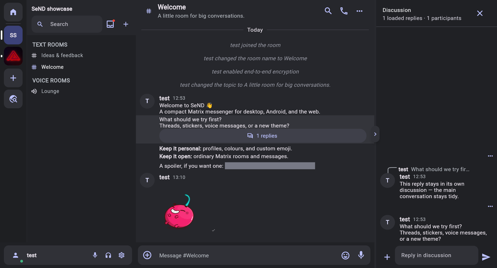

## Sticker picker and Telegram import

The expression picker groups emoji, GIFs and stickers. This example imports two
items from the public [Hot Cherry Telegram pack](https://t.me/addstickers/HotCherry).
The artwork belongs to its respective creator; no standalone pack assets are
redistributed here. The full 34-item animated import was slow during capture;
this screenshot is not a claim that every item was successfully imported.

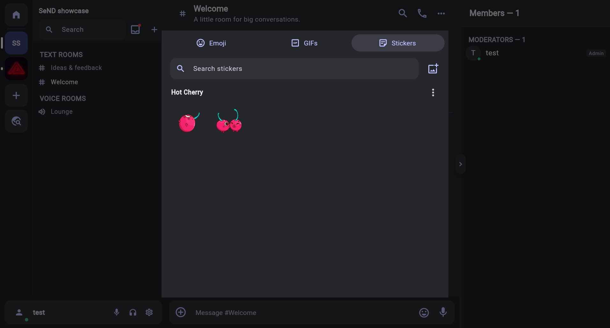

Three static items from [Just zoo it!](https://t.me/addstickers/Animals) were
separately imported as custom emoji. The alias editor and resulting pack in the
picker are shown below; one emoji was also sent to the private showcase room.
These samples do not establish full-pack or animated-emoji import coverage.

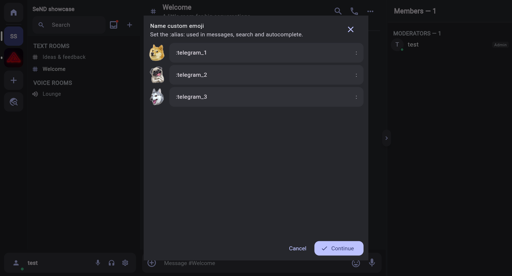

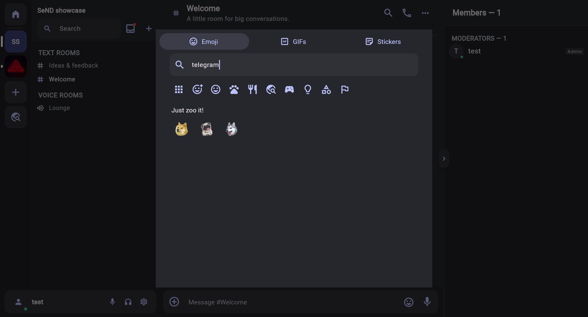

## GIF search

KLIPY search results inside the expression picker. A still screenshot illustrates
the layout, not animation playback. GIF and pack artwork belongs to the respective
creators and is shown only as part of the client UI.

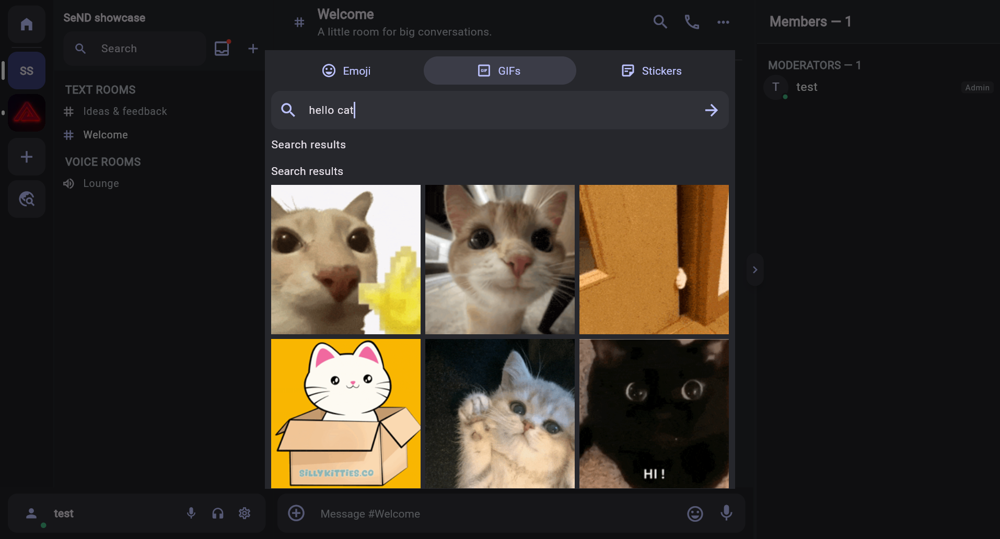

## Forums

Forum channels organize discussions as named posts with tags and replies.

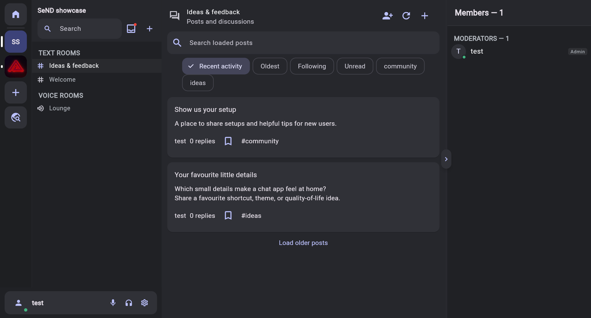

## Voice-channel chat

Preview a voice channel before joining, and keep its text conversation visible
beside it. No call was placed or microphone audio recorded for this capture.

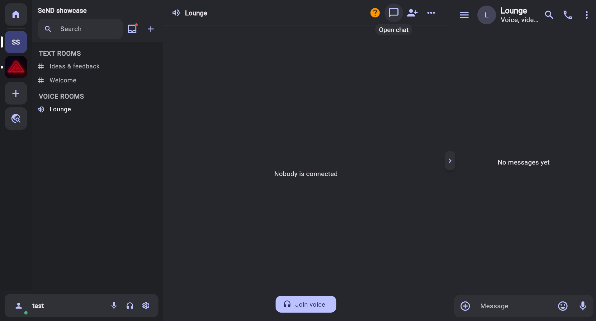

## Profile editing

The editor previews profile colours, biography and the status thought bubble.
The sample text was entered for the preview and discarded, not saved to the
test account's public profile.

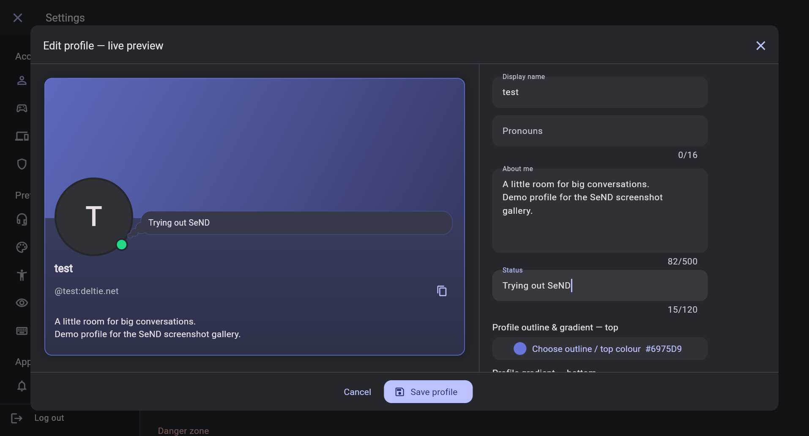

## Activity and privacy

This is the **web** Activity settings page. Native desktop process detection is
not available in the PWA. Last.fm connection and sharing choices are visible;
no Last.fm account was connected for the gallery.

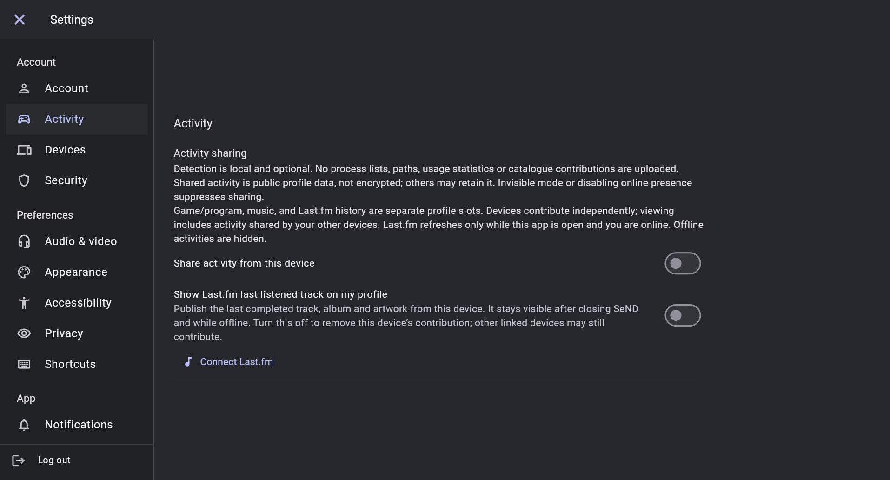

## Themes

The bundled Aero example supplies its own appearance controls through the
declarative theme system. Both the controls and the resulting chat are shown.

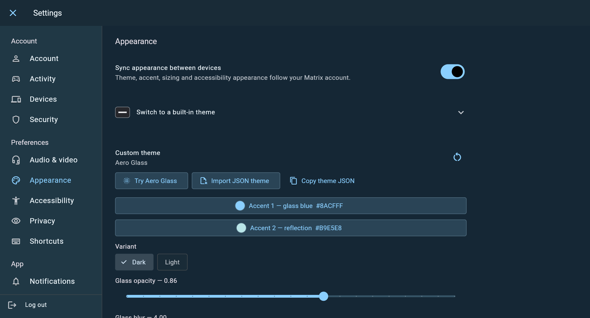

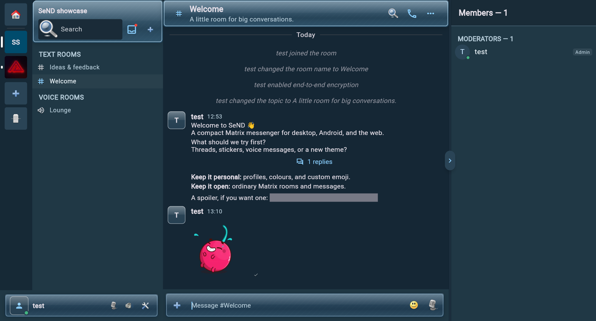

## Space administration

Roles, Matrix permission levels, Space access and shared timeline settings live
in Administration. This capture uses only the private showcase Space and does
not alter permissions in a public community.

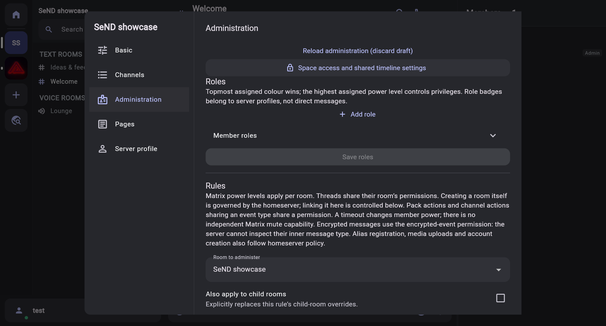

## Mobile layout

Captured with Chromium mobile emulation on Linux. These show responsive layout,
not Safari, iPhone hardware, keyboard positioning or push-notification validation.

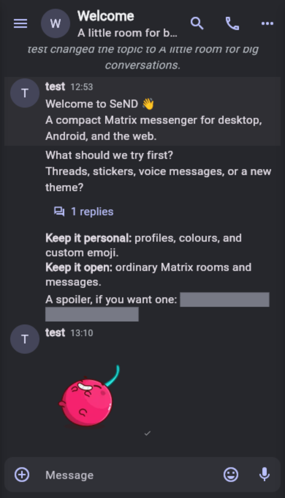

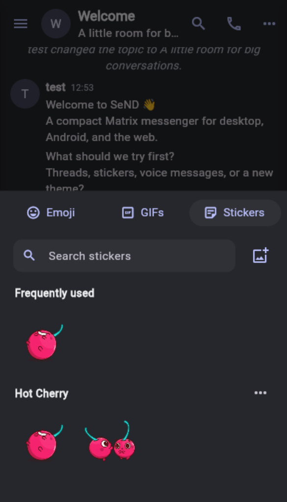

## Capture boundaries

Keep credentials, recovery keys, notification contents and unrelated windows
out of images. Use the private showcase rooms for future captures. Browser
mobile emulation is a layout check, not an iOS/Safari hardware test. Do not ring
other people or publish test packs into shared production Spaces for a screenshot.
